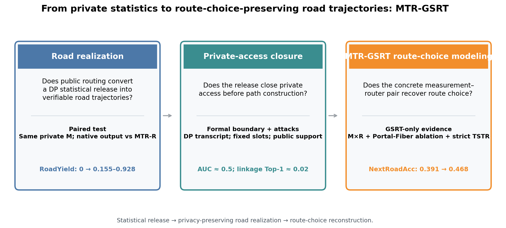
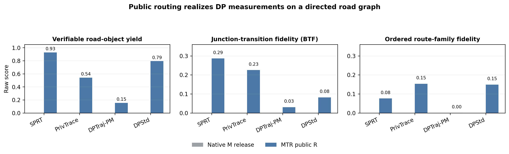
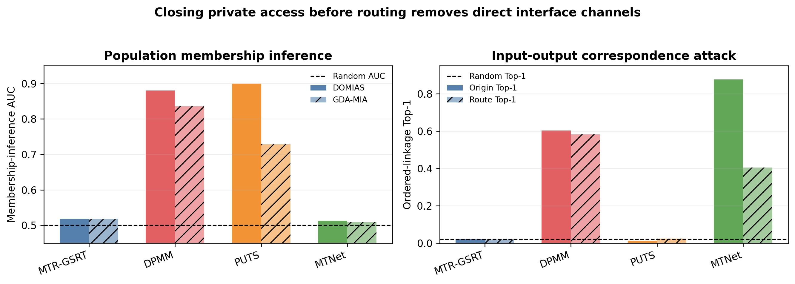
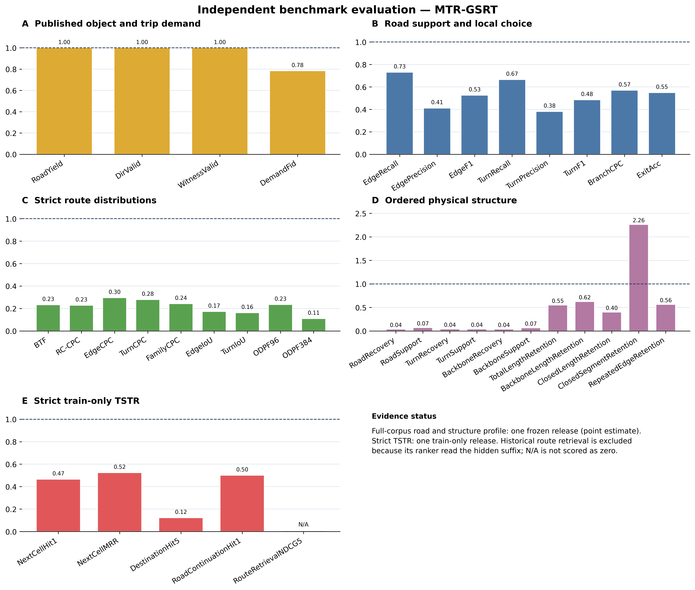
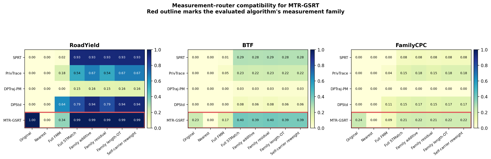
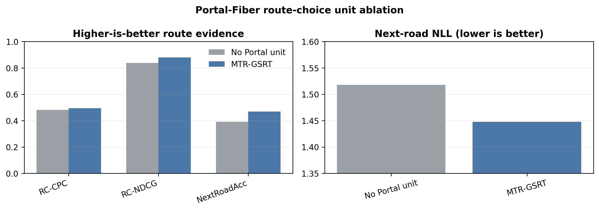
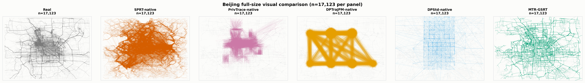

# MTR-GSRT 公开代码与论文实验复现

本目录包含 MTR-GSRT、四种统计式 DP baseline 的合成数据、统一指标结果和论文图片。下面按照实验章节的叙述顺序运行，每一步都会在 `experiment_results/regenerated_figures/` 产生对应的 PNG 和 PDF。



## 0. 安装环境

```powershell
python -m venv .venv
.\\.venv\\Scripts\\Activate.ps1
python -m pip install --upgrade pip
python -m pip install -r requirements.txt
```

安装完成后，本目录中的生成、评估和作图命令均使用这个 Python 3.11 环境。

每条命令的全部参数、默认行为、物理含义和跨数据集替换规则见 [`docs/COMMAND_PARAMETERS_CN.md`](docs/COMMAND_PARAMETERS_CN.md)。所有 `commands/reproduce.py` 入口都按脚本自身位置定位文件夹，因此可以从任意当前目录用绝对脚本路径调用。

仓库提供两条复现路径：直接运行 `python commands/reproduce.py all-precomputed` 可校验已发布合成数据并重画全部论文图；重新生成或重新评价时，由使用者通过 `--data` 提供同格式真实轨迹。真实轨迹不包含在公开仓库中。需要道路级真实参考时，可由同一真实轨迹和公共道路图生成：

```powershell
python commands/reproduce.py prepare-road-reference -- --dataset-config geolife --real "C:\data\real.pkl" --network public_assets\beijing_network\network.shp --stmatch-bin public_assets\matcher\stmatch.exe --runtime-dir public_assets\matcher --max-points 32 --radius-m 200 --gps-error-m 50 --candidates 8 --batch-size 5000 --out-dir "C:\runs\real_road_reference"
```

该命令生成 `C:\runs\real_road_reference\matched_paths\Real.pkl.gz` 及其 manifest，可直接传给下文的 `--real-routes`。`--dataset-config` 提供公开槽位数和城市配置；`--network` 与匹配器参数决定公共地图匹配过程。预计算 baseline 合成数据已经随本仓库发布；需要从源码重新生成四种 baseline 时使用包含 baseline 源码的完整复现目录。

## 1. 从统计发布到道路轨迹

这一实验先得到 SPRT、PrivTrace、DPTraj-PM 和 DPStd 的统计式合成轨迹，再比较它们的原生输出与加入 MTR 公共道路路由后的输出。比较保持私有测量不变，只改变道路重建过程，因此直接展示 MTR 路由带来的 RoadYield、BTF 和 FamilyCPC 变化。

四份已经生成的统计式 DP 合成数据位于：

```text
datasets/synthetic/baselines/
├─ sprt_native.pkl
├─ privtrace_native.pkl
├─ dptrajpm_native.pkl
└─ dpstd_native.pkl
```

每份数据均包含 17,123 条合成轨迹，后续实验直接读取这四份数据。

四种统计发布经过同一公共路由器得到的合成路线对象位于 `datasets/synthetic/route_experiments/`。第一条命令逐条读取这些合成路线，重新检查有向连续性，并从用户提供的真实道路参考重新计算 RoadYield、BTF 和 FamilyCPC；第二条命令只作图：

```powershell
python commands/reproduce.py run-framework -- --real-routes "C:\data\Real.pkl.gz" --routed "SPRT=datasets\synthetic\route_experiments\SPRT\STMatch.pkl.gz" --routed "PrivTrace=datasets\synthetic\route_experiments\PrivTrace\STMatch.pkl.gz" --routed "DPTraj-PM=datasets\synthetic\route_experiments\DPTraj-PM\STMatch.pkl.gz" --routed "DPStd=datasets\synthetic\route_experiments\DPStd\STMatch.pkl.gz" --out-dir experiment_results/recomputed/framework
python commands/reproduce.py plot -- --figure framework --data-root experiment_results/recomputed
```

参数说明：`--real-routes` 是该城市的真实匹配道路路线；每个 `--routed NAME=PATH` 指定一个方法及其在同一道路图上的合成路线；`--out-dir` 保存本轮新计算结果。作图命令中的 `--figure framework` 选择本实验，`--data-root` 强制读取刚生成的结果。迁移城市时还应显式加入 `--edge-cache <新城市缓存>`。

第一条命令实际计算并生成 `framework/results.csv` 和 `framework/manifest.json`；第二条命令读取本次运行结果生成：

```text
experiment_results/regenerated_figures/
├─ 02_mtr_framework_lift.png
└─ 02_mtr_framework_lift.pdf
```



## 2. MTR 两阶段接口的隐私攻击结果

这一实验比较总体成员推断、轨迹成员推断、起点链接和路线链接。MTR 的攻击结果接近随机参考，DPMM 与 private-origin MTNet 作为具有显式对应或私有条件通道的比较接口。

先从同一严格训练/测试划分生成成员、非成员和独立参考集合，再实际运行总体链接与 GDA-MIA：

```powershell
python commands/reproduce.py prepare-split -- --data "C:\data\real.pkl" --train-fraction 0.8 --seed 20260713 --out-dir "C:\runs\strict_split"
python commands/reproduce.py prepare-attack-split -- --split-dir "C:\runs\strict_split" --out-dir "C:\runs\attack_split"
python commands/reproduce.py run-privacy -- --method MTR-GSRT --members "C:\runs\attack_split\member_candidates.pkl" --nonmembers "C:\runs\attack_split\nonmember_candidates.pkl" --reference "C:\runs\attack_split\reference.pkl" --release "datasets\synthetic\mtr_gsrt\trajectories.pkl" --bbox 39.75 40.15 116.10 116.65 --out-dir experiment_results/recomputed/privacy
python commands/reproduce.py plot -- --figure privacy --data-root experiment_results/recomputed
```

参数说明：划分命令的 `--data` 是任意真实轨迹集，`--train-fraction` 是训练比例，`--seed` 固定划分，`--out-dir` 保存互斥划分；攻击划分的 `--split-dir` 读取该结果。`run-privacy` 的 `--method` 是显示名，`--members/--nonmembers/--reference` 是三个互斥攻击集合，`--release` 是被攻击的合成发布，`--bbox` 依次为纬度最小/最大、经度最小/最大，`--out-dir` 保存新攻击结果。

攻击程序从合成发布重新训练攻击分类器并生成 `privacy/results.csv`。本命令执行 MTR 的总体链接和 GDA-MIA；DPMM 与 MTNet 的对照结果位于已发表比较图。



## 3. 从道路合法性到路线选择保真度

先运行 MTR-GSRT，生成本文具体方案的合成道路轨迹：

```powershell
python commands/reproduce.py generate-main -- --data "C:\data\real.pkl" --epsilon-total 7/5 --noise-seed 20260719 --decoder-seed 30260719 --public-slot-count 17123 --bbox 39.75 40.15 116.10 116.65 --osm-cache "C:\data\osm_cache_beijing.pkl" --component-mode full --out-dir "C:\runs\mtr_gsrt"
```

参数说明：`--data` 指定任意坐标轨迹；`--epsilon-total` 是总隐私预算；`--noise-seed/--decoder-seed` 分别固定 DP 噪声和公共路由；`--public-slot-count` 是预声明输出数；`--bbox` 为 `lat_min lat_max lon_min lon_max`；`--osm-cache` 是同城公共道路缓存；`--component-mode full` 启用全部组件；`--out-dir` 是本轮独立输出目录。

输出结构：

```text
C:\runs\mtr_gsrt\
├─ trajectories.pkl          17,123 条坐标轨迹
├─ road_witnesses.pkl        17,123 条道路 witness
├─ dp_transcript.npz         私有测量结果
├─ protocol.json             预算与生成参数
└─ manifest.json             输出文件信息
```

坐标轨迹使用统一评估器计算 Grid、Trip、Length、RoadYield、DirValid、WitnessValid、OD 与任务指标。下面评估新生成的 MTR-GSRT；评估四份 baseline 时分别替换 `--synthetic`，并为每种方法指定不同的输出目录。

```powershell
python commands/reproduce.py evaluate -- --real "C:\data\real.pkl" --synthetic "C:\runs\mtr_gsrt\trajectories.pkl" --witness "C:\runs\mtr_gsrt\road_witnesses.pkl" --bbox 39.75 40.15 116.10 116.65 --osm-cache "C:\data\osm_cache_beijing.pkl" --public-slot-count 17123 --out-dir "C:\runs\metrics\mtr_gsrt"
```

参数说明：`--real` 是真实参考，`--synthetic` 是刚生成的坐标轨迹，`--witness` 是一一对应的道路证明，`--bbox` 与 `--osm-cache` 显式定义数据所在城市及其公共道路图，`--public-slot-count` 是预声明评估条数，`--out-dir` 保存本次指标。已有注册数据集也可用 `--dataset-config` 代替显式公共配置。

输出结构：

```text
C:\runs\metrics\mtr_gsrt\
├─ metrics.json
├─ metrics.csv
└─ manifest.json
```

对刚生成的主方法和四份 baseline 合成数据逐份运行统一评估器，再生成完整效用热力图：

```powershell
python commands/reproduce.py run-profile -- --real "C:\data\real.pkl" --bbox 39.75 40.15 116.10 116.65 --osm-cache "C:\data\osm_cache_beijing.pkl" --public-slot-count 17123 --synthetic "SPRT=datasets\synthetic\baselines\sprt_native.pkl" --synthetic "PrivTrace=datasets\synthetic\baselines\privtrace_native.pkl" --synthetic "DPTraj-PM=datasets\synthetic\baselines\dptrajpm_native.pkl" --synthetic "DPStd=datasets\synthetic\baselines\dpstd_native.pkl" --synthetic "MTR-GSRT=C:\runs\mtr_gsrt\trajectories.pkl" --witness "MTR-GSRT=C:\runs\mtr_gsrt\road_witnesses.pkl" --out-dir experiment_results/recomputed/profile
python commands/reproduce.py plot -- --figure profile --data-root experiment_results/recomputed
```

参数说明：`--real` 是真实参考；每个 `--synthetic NAME=PATH` 加入一份待评估合成数据；`--witness NAME=PATH` 只为发布 witness 的同名方法提供；`--bbox/--osm-cache` 定义同城公共道路；`--public-slot-count` 是预声明评估条数；`--out-dir` 保存逐方法指标。已有注册数据集也可用 `--dataset-config` 作为快捷方式。

统一评估器为每份合成数据生成 `raw/<方法>/metrics.json`，汇总为 `profile/results.csv`，然后生成效用热力图。



## 4. 测量 M 与路由 R 的组合

M×R 实验把同一批私有测量分别交给不同公共路由器，再比较 RoadYield、BTF 与 FamilyCPC。它展示统计测量本身携带了多少道路选择信息，以及路由器能否使用这些信息。

```powershell
python commands/reproduce.py run-mr -- --real-routes "C:\data\Real.pkl.gz" --out-dir experiment_results/recomputed/mr
python commands/reproduce.py plot -- --figure mr --data-root experiment_results/recomputed
```

参数说明：`--real-routes` 是真实道路路线；默认从包内 `route_experiments/<M>/<R>` 读取组合。迁移或加入新组合时使用 `--edge-cache <同图缓存>`、重复的 `--route "M::R=PATH"`，或 `--route-dir <组合根目录>`；`--out-dir` 保存重新计算的矩阵。

第一条命令遍历 `datasets/synthetic/route_experiments/<M>/<R>.pkl[.gz]` 中的每个实际路线输出，从真实道路参考计算每个 M×R 单元的 BTF、RC-CPC、EdgeCPC、TurnCPC 与 FamilyCPC；第二条命令将 `mr/results.csv` 绘制成热力图。



## 5. MTR-GSRT 算法级消融

消融实验保持数据、预算和评估方法一致，只移除或替换算法级测量与路由模块。它给出完整方案与各消融臂在路线选择指标上的差异。

```powershell
python commands/reproduce.py run-ablation -- --data "C:\data\real.pkl" --epsilon-total 7/5 --noise-seed 20260719 --decoder-seed 30260719 --public-slot-count 17123 --bbox 39.75 40.15 116.10 116.65 --osm-cache "C:\data\osm_cache_beijing.pkl" --component-modes full no-portal-fiber no-graph-flow demand-only --out-dir experiment_results/recomputed/ablation
python commands/reproduce.py plot -- --figure ablation --data-root experiment_results/recomputed
```

参数说明：这条命令不读取冻结消融表。它读取显式数据和公共道路资产，用同一预算、随机种子和固定输出规模逐臂重新合成。GSRT 的 `--component-modes` 控制 `full/no-portal-fiber/no-graph-flow/demand-only`；DFR 的 `--variants` 控制端点测量、路线族测量和匹配路由的组合。`--out-dir` 同时保存每一臂新生成的合成数据、指标和汇总表。

第一条命令对每个指定算法臂重新执行私有测量和公共路由，将新合成数据写入 `ablation/arms/`，将逐臂指标写入 `ablation/raw/`，再形成 `ablation/results.csv` 和参数 manifest；第二条命令只读取这些新结果生成 `05_ablation.png` 和 `05_ablation.pdf`。



## 6. 严格 train-only TSTR 测量—路由实验

这一实验同时改变统计发布/私有测量 (M) 和公共道路重建 (R)。真实数据先固定为互斥的 80% 训练集与 20% 测试集；每份合成训练语料只能由训练集生成。随后分别使用原生输出、FMM 和 STMatch 训练下游模型，并在从未进入合成机制的真实测试集上评价。

六个主面板组成三个递进层次：Next-cell Hit@1/MRR 衡量局部移动延续，Destination Hit@5 衡量行程需求，Road continuation Hit@1/MRR 与 Route retrieval NDCG@5 衡量道路选择。Road continuation MRR 计算真实下一道路在完整候选排序中的倒数名次，既保留 Hit@1 的直观含义，又能区分“没有排在第一但排序接近正确”的模型。Destination MRR 与其原始结果保留在 `results_all.csv`，不与同类 Destination Hit@5 重复占用主图面板。每项分数均为

\[
\frac{\text{查询覆盖率}\times\text{已覆盖查询质量}}
{\text{Real-train 查询覆盖率}\times\text{Real-train 查询质量}}.
\]

因此，方法只在少量容易样本上成功时不会得到虚高分数。

### 6.1 生成严格训练侧发布

```powershell
python commands/reproduce.py prepare-split -- --data "C:\data\real.pkl" --train-fraction 0.8 --seed 20260713 --out-dir "C:\runs\strict_split"
python commands/reproduce.py generate-main -- --data "C:\runs\strict_split\train.pkl" --epsilon-total 7/5 --noise-seed 20260719 --decoder-seed 30260719 --public-slot-count 13698 --bbox 39.75 40.15 116.10 116.65 --osm-cache "C:\data\osm_cache_beijing.pkl" --component-mode full --out-dir "C:\runs\tstr_mr\mtr_gsrt"
```

第一条命令生成 `train.pkl`、`test.pkl` 和 `split_manifest.json`；第二条命令只读取 `train.pkl`，生成 13,698 条 MTR-GSRT 轨迹。四份相同训练划分下的统计式发布位于 `datasets/synthetic/train_only_baselines/`。

### 6.2 执行两种公共道路重建

```powershell
python evaluation/evaluation/explore_fmm_road_alignment.py --method "SPRT=datasets\synthetic\train_only_baselines\sprt_train.pkl" --method "PrivTrace=datasets\synthetic\train_only_baselines\privtrace_train.pkl" --method "DPTraj-PM=datasets\synthetic\train_only_baselines\dptrajpm_train.pkl" --method "DPStd=datasets\synthetic\train_only_baselines\dpstd_train.pkl" --method "MTR-GSRT=C:\runs\tstr_mr\mtr_gsrt\trajectories.pkl" --network public_assets\beijing_network\network.shp --fmm public_assets\matcher\fmm.exe --fmm-runtime-dir public_assets\matcher --out-dir "C:\runs\tstr_mr\fmm"
python evaluation/evaluation/cache_common_road_matches.py --dataset-config geolife --real "C:\runs\strict_split\train.pkl" --corpus "SPRT=datasets\synthetic\train_only_baselines\sprt_train.pkl" --corpus "PrivTrace=datasets\synthetic\train_only_baselines\privtrace_train.pkl" --corpus "DPTraj-PM=datasets\synthetic\train_only_baselines\dptrajpm_train.pkl" --corpus "DPStd=datasets\synthetic\train_only_baselines\dpstd_train.pkl" --corpus "MTR-GSRT=C:\runs\tstr_mr\mtr_gsrt\trajectories.pkl" --network public_assets\beijing_network\network.shp --stmatch-bin public_assets\matcher\stmatch.exe --runtime-dir public_assets\matcher --limit 13698 --max-points 32 --radius-m 200 --gps-error-m 50 --candidates 8 --batch-size 5000 --out-dir "C:\runs\tstr_mr\stmatch"
```

`--method/--corpus NAME=PATH` 指定待路由的训练侧发布；`--network`、匹配器二进制和运行库均为公共资源；`--limit 13698` 与冻结训练侧输出规模一致；`--max-points` 控制每条输入用于匹配的公共采样上限；`--radius-m`、`--gps-error-m` 和 `--candidates` 控制候选道路搜索。两个输出目录都包含 `matched_paths/<方法>.pkl.gz` 和运行 manifest。

### 6.3 生成双视图并执行六项任务

```powershell
python commands/reproduce.py materialize-tstr-mr -- --source "SPRT=datasets\synthetic\train_only_baselines\sprt_train.pkl" --source "PrivTrace=datasets\synthetic\train_only_baselines\privtrace_train.pkl" --source "DPTraj-PM=datasets\synthetic\train_only_baselines\dptrajpm_train.pkl" --source "DPStd=datasets\synthetic\train_only_baselines\dpstd_train.pkl" --source "MTR-GSRT=C:\runs\tstr_mr\mtr_gsrt\trajectories.pkl" --fmm-dir "C:\runs\tstr_mr\fmm" --stmatch-dir "C:\runs\tstr_mr\stmatch" --network public_assets\beijing_network\network.shp --out-dir "C:\runs\tstr_mr\views"
```

该命令为每个 (M\times R) 组合生成两份等价视图：`views/generic/` 保持原发布点数，用于网格下游任务；`views/road/` 保留完整有向道路节点，用于道路任务。这样不会因道路几何顶点过密改变通用任务权重，也不会因稀疏重采样跳过中间道路节点。

随后分别运行 Native、FMM 和 STMatch。三条命令完整列出，避免读者依赖隐含的路径替换：

```powershell
python commands/reproduce.py run-tstr -- --train-real "C:\runs\strict_split\train.pkl" --test-real "C:\runs\strict_split\test.pkl" --synthetic "datasets\synthetic\train_only_baselines\sprt_train.pkl" --synthetic "datasets\synthetic\train_only_baselines\privtrace_train.pkl" --synthetic "datasets\synthetic\train_only_baselines\dptrajpm_train.pkl" --synthetic "datasets\synthetic\train_only_baselines\dpstd_train.pkl" --synthetic "C:\runs\tstr_mr\mtr_gsrt\trajectories.pkl" --names SPRT PrivTrace DPTraj-PM DPStd MTR-GSRT --osm-cache "C:\data\osm_cache_beijing.pkl" --bbox 39.75 40.15 116.10 116.65 --out-dir "C:\runs\tstr_mr\scores\native"
python commands/reproduce.py run-tstr -- --train-real "C:\runs\strict_split\train.pkl" --test-real "C:\runs\strict_split\test.pkl" --synthetic "C:\runs\tstr_mr\views\generic\fmm\sprt.pkl" --synthetic "C:\runs\tstr_mr\views\generic\fmm\privtrace.pkl" --synthetic "C:\runs\tstr_mr\views\generic\fmm\dptraj_pm.pkl" --synthetic "C:\runs\tstr_mr\views\generic\fmm\dpstd.pkl" --synthetic "C:\runs\tstr_mr\views\generic\fmm\mtr_gsrt.pkl" --road-synthetic "C:\runs\tstr_mr\views\road\fmm\sprt.pkl" --road-synthetic "C:\runs\tstr_mr\views\road\fmm\privtrace.pkl" --road-synthetic "C:\runs\tstr_mr\views\road\fmm\dptraj_pm.pkl" --road-synthetic "C:\runs\tstr_mr\views\road\fmm\dpstd.pkl" --road-synthetic "C:\runs\tstr_mr\views\road\fmm\mtr_gsrt.pkl" --names "SPRT x FMM" "PrivTrace x FMM" "DPTraj-PM x FMM" "DPStd x FMM" "MTR-GSRT x FMM" --osm-cache "C:\data\osm_cache_beijing.pkl" --bbox 39.75 40.15 116.10 116.65 --out-dir "C:\runs\tstr_mr\scores\fmm"
python commands/reproduce.py run-tstr -- --train-real "C:\runs\strict_split\train.pkl" --test-real "C:\runs\strict_split\test.pkl" --synthetic "C:\runs\tstr_mr\views\generic\stmatch\sprt.pkl" --synthetic "C:\runs\tstr_mr\views\generic\stmatch\privtrace.pkl" --synthetic "C:\runs\tstr_mr\views\generic\stmatch\dptraj_pm.pkl" --synthetic "C:\runs\tstr_mr\views\generic\stmatch\dpstd.pkl" --synthetic "C:\runs\tstr_mr\views\generic\stmatch\mtr_gsrt.pkl" --road-synthetic "C:\runs\tstr_mr\views\road\stmatch\sprt.pkl" --road-synthetic "C:\runs\tstr_mr\views\road\stmatch\privtrace.pkl" --road-synthetic "C:\runs\tstr_mr\views\road\stmatch\dptraj_pm.pkl" --road-synthetic "C:\runs\tstr_mr\views\road\stmatch\dpstd.pkl" --road-synthetic "C:\runs\tstr_mr\views\road\stmatch\mtr_gsrt.pkl" --names "SPRT x STMatch" "PrivTrace x STMatch" "DPTraj-PM x STMatch" "DPStd x STMatch" "MTR-GSRT x STMatch" --osm-cache "C:\data\osm_cache_beijing.pkl" --bbox 39.75 40.15 116.10 116.65 --out-dir "C:\runs\tstr_mr\scores\stmatch"
```

每次运行生成 `raw_generic/`、`raw_road/`、`results.csv` 和 `manifest.json`。最后合并三个真实执行结果并作图：

```powershell
python commands/reproduce.py combine-tstr-mr -- --native "C:\runs\tstr_mr\scores\native\results.csv" --fmm "C:\runs\tstr_mr\scores\fmm\results.csv" --stmatch "C:\runs\tstr_mr\scores\stmatch\results.csv" --out-dir experiment_results/recomputed/tstr
python commands/reproduce.py plot -- --figure tstr --data-root experiment_results/recomputed
```

最终得到 `results.csv` 中 90 个主图任务单元（5 种测量/发布、3 种公共重建、6 项互补指标）以及 `results_all.csv` 中 105 个完整任务单元（额外保留 Destination MRR），并生成 `06_strict_tstr.png/pdf`。


## 7. 空间轨迹比较

Real 与各合成方法在同一北京道路背景上的空间分布。图中直接展示道路实现、走廊覆盖和空间集中程度。

```powershell
python commands/reproduce.py run-structure -- --dataset "Real=C:\data\real.pkl" --dataset "SPRT=datasets\synthetic\baselines\sprt_native.pkl" --dataset "PrivTrace=datasets\synthetic\baselines\privtrace_native.pkl" --dataset "DPTraj-PM=datasets\synthetic\baselines\dptrajpm_native.pkl" --dataset "DPStd=datasets\synthetic\baselines\dpstd_native.pkl" --dataset "MTR-GSRT=C:\runs\mtr_gsrt\trajectories.pkl" --out-dir experiment_results/recomputed/structure
python commands/reproduce.py plot -- --figure structure --data-root experiment_results/recomputed
```

参数说明：每个 `--dataset "NAME=PATH"` 加入一份真实或合成轨迹，允许替换为任意同坐标系数据；`--out-dir` 保存逐轨迹诊断和汇总。作图命令只读取该目录。

第一条命令逐轨迹重新计算可用率、点数、重复访问、闭合行程和路径直接度，生成 `structure/results.csv`；第二条命令只负责绘图。



## 8. 按顺序运行整套实验

第 1–7 节中的每个实验都由“生成或读取合成发布 → 执行评估 → 作图”三步组成。依次运行各节命令后，可统一重画已经产生实验结果的图：

```powershell
python commands/reproduce.py plot -- --figure all --data-root experiment_results/recomputed
```

参数说明：`--figure all` 依次绘制全部实验；`--data-root` 指向前面各实验实际生成的共同结果根目录，任一结果缺失都会报错，不会退回冻结表格。

前六个 `run-*` 入口和 `run-structure` 分别生成七个实验子目录；上述命令从这些结果统一生成八张 PNG 和 PDF。

完整数值分析见 `docs/FROZEN_EXPERIMENT_REPORT_CN.md`。
