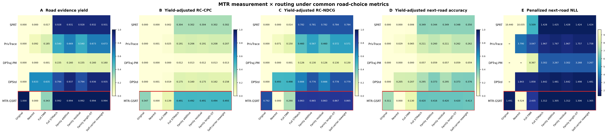

# 两份审稿回复共用的 M×R 道路实验

此实验同时对应 rebuttal1-Q2 和 rebuttal2-Q4。两处引用同一个 5×8 结果目录，不重复计算、存储或改写审稿回复文档。五个私有测量/生成方法为 SPRT、PrivTrace、DPTraj-PM、DPStd、MTR-GSRT；八个道路接口为 Original、Nearest、Full FMM、Full STMatch、Family additive、Family residual、Family length-OT、Self-carrier reweight。

先按根目录 `README_CN.md` 准备 Python 3.11.15、`requirements-lock.txt`、北京真实预处理轨迹文件及 Windows FMM/STMatch 运行库。包内 `datasets/synthetic/baselines/*.pkl` 与 `datasets/synthetic/mtr_gsrt/trajectories.pkl` 是已经生成的完整 17,123 条坐标发布；真实轨迹及真实道路匹配缓存不随公开仓库上传。以下所有命令在本文件夹根目录执行；`C:\runs\rebuttal_mr` 可以替换为任意新的本地输出目录。

## 1. 生成同一公共图上的真实道路参考

```powershell
python commands/reproduce.py verify-matcher -- --stmatch-bin public_assets/matcher/stmatch.exe --fmm-bin public_assets/matcher/fmm.exe --runtime-dir "C:\fmm-runtime"
python commands/reproduce.py prepare-road-reference -- --dataset-config geolife --real "C:\data\real_full_frozen.pkl" --network public_assets/beijing_network/network.shp --stmatch-bin public_assets/matcher/stmatch.exe --runtime-dir "C:\fmm-runtime" --max-points 32 --radius-m 200 --gps-error-m 50 --candidates 8 --batch-size 20000 --omp-threads-per-worker 8 --out-dir "C:\runs\rebuttal_mr\real_match"
```

第一条命令核对匹配器及 DLL；第二条命令从真实坐标轨迹生成 `C:\runs\rebuttal_mr\real_match\matched_paths\Real.pkl.gz` 和匹配 manifest。`--max-points` 是每条轨迹的等距观测点上限；`--radius-m` 是候选道路搜索半径；`--gps-error-m` 是匹配器的 GPS 误差尺度；`--candidates` 是每点候选数；`--batch-size` 与线程数只控制运行资源。真实参考只在本机评分，不进入合成路线文件。

## 2. 实际生成 Original 与 Nearest 行

```powershell
$corpora = @(
  @("SPRT", "datasets/synthetic/baselines/sprt_native.pkl", "both"),
  @("PrivTrace", "datasets/synthetic/baselines/privtrace_native.pkl", "both"),
  @("DPTraj-PM", "datasets/synthetic/baselines/dptrajpm_native.pkl", "both"),
  @("DPStd", "datasets/synthetic/baselines/dpstd_native.pkl", "both"),
  @("MTR-GSRT", "datasets/synthetic/mtr_gsrt/trajectories.pkl", "nearest")
)
foreach ($item in $corpora) {
  python evaluation/materialize_direct_road_rows.py --input $item[1] --method $item[0] --mode $item[2] --network public_assets/beijing_network/network.shp --edge-cache public_assets/ordered_portal_route_cache.pkl.gz --max-points 32 --radius-m 200 --out-dir "C:\runs\rebuttal_mr\direct\$($item[0])"
}
```

每个方法生成 `Nearest.pkl.gz`；四个统计基线还生成 `Original.pkl.gz`。MTR-GSRT 原生道路 witness 对应的 `Original.pkl` 已随 `datasets/synthetic/route_experiments/MTR-GSRT/` 保存，不从坐标重新推断。Original 只承认坐标直接给出的连续有向边；Nearest 将采样点分别投到半径内最近的有向道路段，删除连续重复边，但**不插入连接路径**。若所得边序列不连通，后续 RoadYield 将该槽计为失败。两种模式都有实际计算的输出文件和 SHA-256 manifest，没有“空值代表实验结果”的占位。

## 3. 生成 Full FMM 与 Full STMatch 行

包内 `datasets/synthetic/route_experiments/<方法>/FMM.pkl.gz` 和 `STMatch.pkl.gz` 是保存的完整发布匹配结果；它们可直接用于第 5 步。要从坐标重新执行匹配，用下面的命令生成新的对应缓存。

```powershell
python evaluation/evaluation/prepare_road_evaluation_network.py --dataset-config geolife --out-dir "C:\runs\rebuttal_mr\fmm_network" --ubodt-format csv --ubodt-delta-m 1500 --ubodt-bin public_assets/matcher/ubodt_gen.exe --fmm-runtime-dir "C:\fmm-runtime"
python evaluation/evaluation/explore_fmm_road_alignment.py --method "SPRT=datasets/synthetic/baselines/sprt_native.pkl" --method "PrivTrace=datasets/synthetic/baselines/privtrace_native.pkl" --method "DPTraj-PM=datasets/synthetic/baselines/dptrajpm_native.pkl" --method "DPStd=datasets/synthetic/baselines/dpstd_native.pkl" --method "MTR-GSRT=datasets/synthetic/mtr_gsrt/trajectories.pkl" --real "C:\data\real_full_frozen.pkl" --dataset-config geolife --network "C:\runs\rebuttal_mr\fmm_network\network.shp" --ubodt "C:\runs\rebuttal_mr\fmm_network\ubodt.txt" --fmm public_assets/matcher/fmm.exe --fmm-runtime-dir "C:\fmm-runtime" --limit 17123 --max-points 32 --radius-m 200 --gps-error-m 50 --candidates 8 --routes-out-dir "C:\runs\rebuttal_mr\fmm" --out-dir "C:\runs\rebuttal_mr\fmm_audit"
python evaluation/evaluation/cache_common_road_matches.py --dataset-config geolife --real "C:\data\real_full_frozen.pkl" --corpus "SPRT=datasets/synthetic/baselines/sprt_native.pkl" --corpus "PrivTrace=datasets/synthetic/baselines/privtrace_native.pkl" --corpus "DPTraj-PM=datasets/synthetic/baselines/dptrajpm_native.pkl" --corpus "DPStd=datasets/synthetic/baselines/dpstd_native.pkl" --corpus "MTR-GSRT=datasets/synthetic/mtr_gsrt/trajectories.pkl" --network public_assets/beijing_network/network.shp --stmatch-bin public_assets/matcher/stmatch.exe --runtime-dir "C:\fmm-runtime" --limit 17123 --max-points 32 --radius-m 200 --gps-error-m 50 --candidates 8 --batch-size 20000 --omp-threads-per-worker 8 --out-dir "C:\runs\rebuttal_mr\stmatch"
```

FMM 的 `--ubodt-delta-m 1500` 是旧完整 FMM 批次使用的公共最短路预处理半径；`network.shp` 与 `ubodt.txt` 必须来自同一次建图。预期分别得到 `fmm/matched_paths/<方法>.pkl.gz` 与 `stmatch/matched_paths/<方法>.pkl.gz`，各含 17,123 个槽；匹配失败保留为空槽，不能删掉后再评分。

## 4. 为每个测量方法生成四种路径族重采样

```powershell
$methods = @(@("SPRT",0), @("PrivTrace",1), @("DPTraj-PM",2), @("DPStd",3), @("MTR-GSRT",5))
foreach ($item in $methods) {
  python evaluation/materialize_family_routers.py --stmatch-route "C:\runs\rebuttal_mr\stmatch\matched_paths\$($item[0]).pkl.gz" --method $item[0] --method-index $item[1] --edge-cache public_assets/ordered_portal_route_cache.pkl.gz --head-threshold 36 --out-dir "C:\runs\rebuttal_mr\family\$($item[0])"
}
```

若暂不重跑 STMatch，把 `--stmatch-route` 换为 `datasets/synthetic/route_experiments/<方法>/STMatch.pkl.gz`。`--head-threshold 36` 规定至少出现 36 次的有序 Region96 路线族；四种路由分别使用同方法载体的族质量、残差质量、族内长度分位数及载体重加权。`--method-index` 固定历史随机种子：MTR-GSRT 为 5，因为原探索中索引 4 是本次五方法表未使用的 no-Q5 臂。每个方法输出四个 `.pkl.gz` 和四个 `.manifest.json`，每个输出保留 17,123 个槽。五方法共 20 个生成输出已逐条与原隔离实验比对相同。

## 5. 同一评价器计算 40 格并作图

```powershell
python evaluation/evaluate_rebuttal_mr.py --real-routes "C:\runs\rebuttal_mr\real_match\matched_paths\Real.pkl.gz" --edge-cache public_assets/ordered_portal_route_cache.pkl.gz --network public_assets/beijing_network/network.shp --native-dir datasets/synthetic/route_experiments --direct-dir "C:\runs\rebuttal_mr\direct" --family-dir "C:\runs\rebuttal_mr\family" --fmm-dir "C:\runs\rebuttal_mr\fmm\matched_paths" --stmatch-dir "C:\runs\rebuttal_mr\stmatch\matched_paths" --slots 17123 --real-test-fraction 0.2 --mixture-weight 0.5 --region-key labels384 --out-dir "C:\runs\rebuttal_mr\metrics"
```

`--real-routes` 是上一步真实参考；`--native-dir` 提供 MTR 的原生 witness 路线；另外四个目录分别提供直接映射、路径族、FMM、STMatch 结果。`--slots` 是总分母；`--real-test-fraction` 只指定回顾式真实道路参考的尾部 20%；`--mixture-weight` 是 next-road 评分的公共混合权重；`--region-key` 指定公共商图标签。输出目录包含 `mr_paper_metrics.csv`（40 行×五项核心指标及诊断列）、`mr_paper_metrics_heatmap.pdf/png` 与绑定所有输入哈希的 `manifest.json`。若用包内 FMM/STMatch 缓存，不传 `--fmm-dir/--stmatch-dir`。



保存的 31 个原本就有真实缓存的单元，重新评分与旧补充图源逐项一致；旧图将五个 Nearest 和四个基线 Original 写成空占位。新实验实测 Nearest 的 RoadYield 分别为 SPRT 0.00018、PrivTrace 0.09198、DPTraj-PM 0、DPStd 0.63324、MTR-GSRT 0.00029。因此**新的图不能被宣称与尚未更新的旧回复 PDF 完全相同**。本仓库同时保留“原生道路证据”与“公共适配后完整有向路径”两种定义：后者使用完整 17,123 槽作为失败分母；路径族路由明确以各方法 STMatch 载体为输入，不冒称直接作用于原始坐标。
