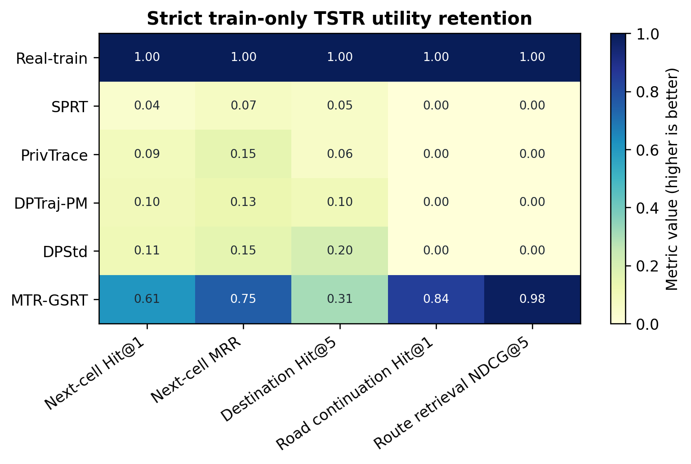

# 严格 train-only TSTR 全方法结果

## 协议

- 真实训练集：13,698 条；真实测试集：3,425 条；记录索引交集为 0。
- SPRT、PrivTrace、DPTraj-PM、DPStd 和 MTR-GSRT 均只使用训练集生成 13,698 条合成轨迹。
- 每个下游模型仅在相应合成数据上训练，并统一在未参与任何合成测量的真实测试集上评估。
- 所有方法共享相同划分、公共北京道路图、输出条数和下游评估器。
- 表中保真率为合成训练语料得分除以同协议 Real-train 得分；Real-train 因而固定为 1。

## 完整 TSTR 保真率

| 训练语料 | Next-cell Hit@1 | Next-cell MRR | Destination Hit@5 | Road continuation Hit@1 | Route retrieval NDCG@5 |
|---|---:|---:|---:|---:|---:|
| Real-train | 1.000 | 1.000 | 1.000 | 1.000 | 1.000 |
| SPRT | 0.038 | 0.067 | 0.051 | 0.000 | 0.000 |
| PrivTrace | 0.089 | 0.147 | 0.057 | 0.000 | 0.000 |
| DPTraj-PM | 0.095 | 0.125 | 0.101 | 0.000 | 0.000 |
| DPStd | 0.107 | 0.152 | 0.205 | 0.000 | 0.000 |
| **MTR-GSRT** | **0.609** | **0.752** | **0.306** | **0.843** | **0.981** |

MTR-GSRT 在五个任务上均为最优合成方法。相对于最强统计式基线，Next-cell Hit@1 保真率从 0.107 提升至 0.609，Road continuation Hit@1 从 0 提升至 0.843，Route retrieval NDCG@5 从 0 提升至 0.981。后两项差异来自发布对象本身：四种统计式输出无法形成足够长的连续有向道路片段，因而无法训练道路续接与路线检索模型；MTR-GSRT 的公共路由阶段将私有测量恢复为有向道路路径。

## 原始任务值

Real-train 的 Next-cell Hit@1、Next-cell MRR、Destination Hit@5、Road continuation Hit@1 和 Route retrieval NDCG@5 分别为 0.6275、0.7584、0.6229、0.8288 和 0.8271。MTR-GSRT 的对应原始值分别为 0.3823、0.5704、0.1907、0.6987 和 0.8110。

严格 NextRoad 评估使用论文的 destination-conditioned next-region 模型，结果为：

| 训练语料 | NextRoadAcc ↑ | NextRoadNLL ↓ |
|---|---:|---:|
| Real-train | 0.6357 | 2.2324 |
| SPRT | 0.1887 | 3.9346 |
| PrivTrace | 0.2812 | 3.6599 |
| DPTraj-PM | 0.0187 | 5.4397 |
| DPStd | 0.2325 | 3.6761 |
| **MTR-GSRT** | **0.5628** | **2.6170** |

## 产物

- 聚合结果：`full_task_suite/results.csv`
- 通用移动任务：`full_task_suite/raw_generic/generic_mobility_tasks.json`
- 道路任务：`full_task_suite/raw_road/road_network_mining_tasks.json`
- NextRoad：`strict_nextroad_results/strict_nextroad.json`
- 轨迹、协议与划分审计：`AUDIT_MANIFEST.json`

`verify_artifacts.py` 与全任务一致性检查均通过：五种合成方法各包含 13,698 条 train-only 发布，测试集包含 3,425 条未参与合成的真实记录，所有聚合分数有限且位于 `[0,1]`。
